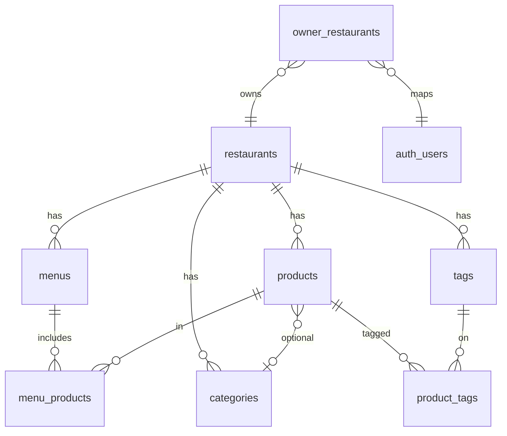
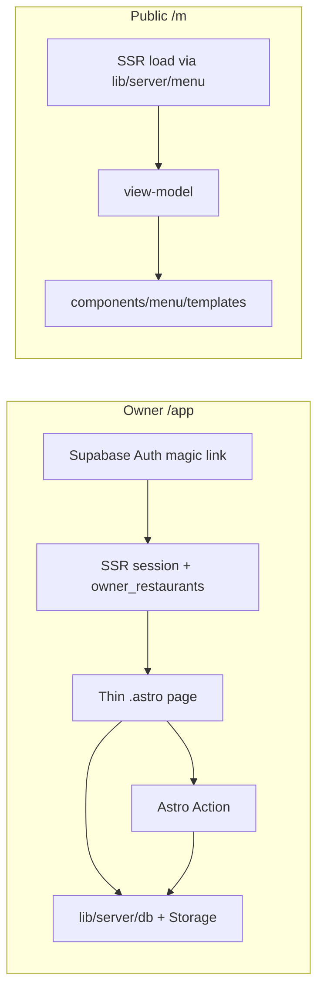

# DigiMenu v2 — Agent & contributor guide

> **Status:** Decisions locked for Alpha ([DIG-2](https://linear.app/cheij-lab/issue/DIG-2/alpha-collaborative-agentsmd-architecture-and-file-structure)).  
> Phase 0 starts only after checkpoint [DIG-9](https://linear.app/cheij-lab/issue/DIG-9) (go/no-go humano).  
> **Edits to this file:** only after explicit human confirmation.

## Product in one line

Restaurant owners manage digital menus in `/app`; guests see branded menus at `/m/{restaurant}` (+ `/{menu}`).

**Scale today:** 1 developer, 1 restaurant user. Prefer simple paths; do not build abstractions “for later” without consensus. Schema/RLS may anticipate N restaurants cheaply; UX and Phase-4 features stay deferred until they hurt.

## Stack

- Astro (SSR) + Starwind + Tailwind v4
- Supabase (Auth, Postgres, Storage)
- Vercel (Node adapter)
- **Nanostores** — client UI state in `lib/client/*` (filters, pending edits, toasts). Not a server/data layer; mutations still go through Astro Actions → `lib/server/*`.
- **Not using:** EmDash, D1, R2-via-EmDash, draft/publish CMS ceremony

## Language

| Surface | Language |
|---------|----------|
| Linear, product UI, chat | Spanish (ES) |
| Commits | Short (EN or ES; keep brief) |
| Code: folders, modules, TS identifiers | English |
| DB: tables & columns | English (`restaurants`, `menu_products`, …). CSV ES headers map in import/export. |

## Legacy reference (DigiMenu EmDash / v1)

| | Path |
|--|------|
| This repo | `/Users/ignaciomallaviabarrena/Documents/programacion/digimenu-v2` |
| Sibling (parity / port reference) | `/Users/ignaciomallaviabarrena/Documents/programacion/digimenu` |

Agents: resolve the sibling as `../digimenu` from this repo root, or the absolute path above. Do not assume it is nested inside digimenu-v2.

## Parity source of truth

For CP2 / CP3 gates:

1. Sibling repo at `/Users/ignaciomallaviabarrena/Documents/programacion/digimenu` (implementation reference)
2. Written checklist in this repo (`docs/parity.md` when created)
3. Production only for visual smoke

CSV backup: `/Users/ignaciomallaviabarrena/Documents/programacion/digimenu/backups/` (e.g. `emdash-2026-07-26/`) — restore mapping later, not UX design.

## Module map (approved)

```text
src/
  pages/                         # thin routes: load + render + wire Actions
  layouts/                       # Root, Dashboard (/app), Menu (/m), AppGuest
  components/
    app/                         # owner UI
    menu/
      templates/                 # Classic+, render-only templates
    starwind/                    # Starwind CLI output — import from here
  actions/                       # Astro Actions → call lib/server/* only
  lib/
    domain/                      # pure types, brand/theme parsers (no I/O) + domain.md
    server/
      db/                        # Supabase queries/mutations + db.md
      auth/                      # session, requireOwner + auth.md (cookie deferred)
      menu/                      # public loaders, view-model + menu.md
      owner/                     # CSV, batch orchestration + owner.md
    client/
      menu/                      # public client (e.g. filters) → index.ts + menu.md
      owner/                     # owner client (inline/batch UI) → index.ts + owner.md
supabase/
  migrations/                    # Postgres + Storage policies SQL
docs/                            # parity checklist, backup notes (not architecture diagrams)
```

### Import rules

- `.astro` pages/layouts and `src/actions/*` may import `lib/server/*` and `lib/domain/*`.
- Browser scripts may import `lib/client/*` and `lib/domain/*` only.
- `lib/client` **must never** import `lib/server`.
- Nanostores stores live under `lib/client/<area>/` (with the area’s other client modules).
- Starwind: import from `@/components/starwind/<component>` (CLI-installed source). No extra `components/ui` wrapper layer unless a DigiMenu-specific API is agreed.
- Client modules: `lib/client/<area>/<entity>.ts` re-exported from `lib/client/<area>/index.ts`.

### Documentation in lib

Each `lib/**/<area>/` that holds functions must include `<area>.md` describing:

- Purpose of the module
- How entities interact (orchestration), not a new function per Linear ticket
- Public entrypoints agents should reuse

Diagrams for architecture live as mermaid **in this file**. Use `docs/` for parity/backup only.

## Anti-patterns (forbidden)

1. **Fat `.astro`:** treat pages as a render engine — no deep nesting, no heavy branching, no business logic. Load data, render components, wire Actions.
2. **Lib sprawl:** no orphan `lib/foo` without ownership and an `<area>.md`. Prefer extending existing server/client areas.
3. **JSON `string[]` as relations:** M2M must be real junction tables (`menu_products`, `product_tags`). (JSONB for brand/theme config is fine.)
4. **Dual write paths:** one mutation path — Astro Actions → `lib/server/*`. No parallel REST for the same write (except agreed upload/CSV helpers that still call the same server modules).
5. **CMS admin as product UI:** no EmDash (or similar) admin dependency.
6. **Unconsented abstractions:** no “just in case” layers without human OK.

## Domain sketch



### Domain rules (Alpha)

- **IDs:** UUID PKs; `slug` unique per restaurant where public URLs need it.
- **Tenancy:** `owner_restaurants` (N:N). UX may assume one active restaurant; schema stays ready for more.
- **Visibility:** no draft/publish CMS. Use simple flags (`active` / `available`) for presence/stock later.
- **Brand / theme:** JSONB on `restaurants`:
  - `brand` — palette + typefaces (identity)
  - `theme` — semantic roles for the public menu (values chosen from `brand`)
  - Parsed/validated in `lib/domain`; public layout exposes CSS variables; templates only consume vars.
- **Media:** Storage paths `{restaurant_id}/…`; public URL stored on the row.
- **Schema columns:** [docs/schema.md](./docs/schema.md) ([DIG-10](https://linear.app/cheij-lab/issue/DIG-10)).

## Request flows



### Auth & Supabase clients

| Client | Use |
|--------|-----|
| SSR user / anon (`@supabase/ssr`) | All HTTP requests; RLS applies |
| Service role | Seed/scripts only — **never** in public pages, Actions serving browsers, or client bundles |

- Phase 0 auth: magic link only (OAuth later, Phase 4).
- Tenancy: `requireOwner` loads restaurants via `owner_restaurants` (DIG-13). Signed `digimenu_owner` cookie **deferred** (Alpha uses session + DB lookup).
- RLS by restaurant ownership via `owner_restaurants` from Phase 1.

### Mutations

Astro Actions in `src/actions/` → `lib/server/*`. Pages stay free of mutation logic.

### Live collections & cache

- Astro **live collections:** explore later; do not block Phase 0–1 scaffold. If adopted, loaders must be thin wrappers over `lib/server/*` (no second data layer).
- Public cache / ISR-style revalidation: investigate in Phase 3 ([DIG-26](https://linear.app/cheij-lab/issue/DIG-26)); no Cloudflare Cache API patterns.

## What we will NOT port from EmDash

- `/_emdash/admin` as owner surface
- Draft / publish / revisions as product features
- Portable Text pages (unless later product need)
- Taxonomy engine (categories are normal tables)
- EmDash plugins / Visual Edit dependency
- Any EmDash package imports

## Deferred (explicit)

| Topic | Until |
|-------|--------|
| Self-serve onboarding | Phase 4 |
| Google OAuth | Phase 4 |
| Custom domains / subdomains | Phase 4 (slugs ready earlier) |
| Multi-template gallery | Phase 4 (Classic only through CP3; registry can exist minimal) |
| Full schema column list | Done — see `docs/schema.md` (DIG-10) |
| Live collections adoption | Spike when useful |
| Vercel cache / ISR details | Phase 3 DIG-26 |

## Agent working agreement

- **1 Linear issue → 1 PR** (unless human says otherwise).
- **Definition of Done:** acceptance criteria on the issue; `astro build` (or agreed check) passes; no new folders outside the module map; prefer extending documented `lib/*` entrypoints.
- **AGENTS.md changes:** propose in chat; edit only after affirmative human OK; append the session log.
- **Legacy reference:** read `/Users/ignaciomallaviabarrena/Documents/programacion/digimenu` (or `../digimenu`) for parity; do not copy EmDash admin, draft, Portable Text, or taxonomy engine.
- **Roadmap:** [DigiMenu v2 on Linear](https://linear.app/cheij-lab/project/digimenu-v2-0a84b080f200).

## Session log

| Date | Decision |
|------|----------|
| 2026-07-26 | Repo created; AGENTS.md stub opened for DIG-2 |
| 2026-07-26 | DIG-2 collaborative lock: module map `lib/{domain,server,client}`, Actions in `src/actions`, Starwind direct imports, junctions not JSON M2M, brand/theme JSONB, SSR+RLS clients, thin `.astro`, `lib/**/<area>.md`, parity via sibling digimenu + `docs/parity.md`, no EmDash |
| 2026-07-26 | Stack: Nanostores for `lib/client` state; legacy path locked to `/Users/ignaciomallaviabarrena/Documents/programacion/digimenu` |
| 2026-07-27 | DIG-10: DB tables/columns English (`restaurants`, `menu_products`, …); CSV ES↔EN in import/export; `price numeric(12,2)`; flags `active`/`available`; see `docs/schema.md` |
| 2026-07-27 | DIG-11: RLS via `owner_restaurants` + `is_restaurant_owner()`; anon reads active public rows; client restaurant INSERT deferred to DIG-27; see `docs/rls.md` |
| 2026-07-27 | DIG-12: `lib/domain` row types + `lib/server/db` CRUD/junctions over SSR Supabase client; no EmDash |
| 2026-07-27 | DIG-13: `requireOwner` via `owner_restaurants` + `/app/pending`; `digimenu_owner` cookie deferred |
| 2026-07-27 | DIG-14: synthetic `seed-demo` SQL + CSV import plan docs (no Finca restore) |
| 2026-07-27 | DIG-15 CP1 PASS: schema/RLS/db/tenancy/seed verified — see `docs/cp1.md` |
| 2026-07-27 | DIG-22 CP2 PASS + GO Phase 3: owner `/app` feature parity — see `docs/parity-owner.md` (Resumen counts / legacy redirects as follow-ups) |
