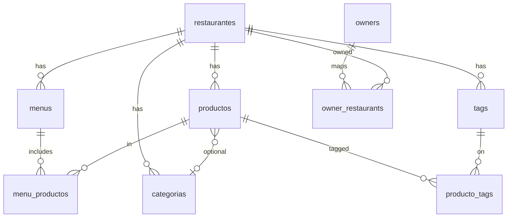
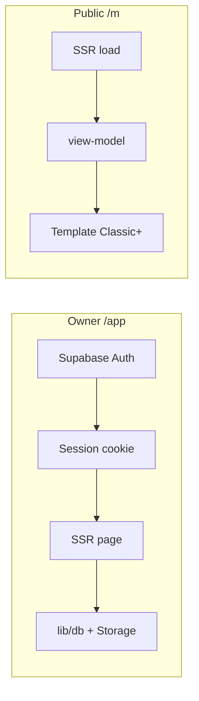

# DigiMenu v2 — Agent & contributor guide

> **Status:** Draft — fill collaboratively (Linear [DIG-2](https://linear.app/cheij-lab/issue/DIG-2/alpha-collaborative-agentsmd-architecture-and-file-structure)).  
> Phase 0 must not start until this is approved ([DIG-9](https://linear.app/cheij-lab/issue/DIG-9)).

## Product in one line

Restaurant owners manage digital menus in `/app`; guests see branded menus at `/m/{restaurant}` (+ `/{menu}`).

## Stack

- Astro (SSR) + Starwind + Tailwind
- Supabase (Auth, Postgres, Storage)
- Vercel (Node adapter)
- **Not using:** EmDash, D1, R2-via-EmDash, draft/publish CMS ceremony

## Goals for this document

Agree on:

1. How we **diagram** the project (domain + request flows)
2. How we **structure files** so pages stay thin and logic stays findable
3. Explicit **anti-patterns** we refuse to repeat from v1

---

## Anti-patterns (from DigiMenu EmDash era)

- [ ] Deep nested conditionals / branching UI logic inside `.astro` pages
- [ ] Many small `lib/*` folders with unclear ownership (“lib sprawl”)
- [ ] JSON `string[]` pretending to be relations (use real FKs / junctions)
- [ ] Dual write paths (in-process + REST) for the same mutation
- [ ] Product UI depending on a CMS admin

*(Refine wording together.)*

---

## Proposed module map (TO DISCUSS)

Replace with the agreed layout. Placeholder only:

```text
src/
  pages/          # thin route entrypoints only
  layouts/
  components/     # UI by surface: app/ | menu/ | ui/
  lib/
    domain/       # pure types + domain helpers (no I/O)
    db/           # Supabase queries / mutations
    auth/         # session, requireOwner
    menu/         # public view-model, templates registry
    owner/        # owner-only orchestration (CSV, batch, etc.)
```

Open questions:

- [ ] ES vs EN for table/column names?
- [ ] Where do client scripts live (`*-client.ts` next to feature vs `lib/.../client`)?
- [ ] One `components/ui` (Starwind wrappers) vs import Starwind directly?
- [ ] `docs/` for diagrams vs mermaid only in this file?

---

## Domain sketch (TO DISCUSS)



---

## Request flows (TO DISCUSS)



---

## What we will NOT port from EmDash

- `/_emdash/admin` as owner surface
- Draft / publish / revisions as product features
- Portable Text pages (unless later product need)
- Taxonomy engine (categories are normal tables)
- EmDash plugins / Visual Edit dependency

---

## Working agreement

- Thin `.astro`: load data, render components, wire forms — logic in `lib/`
- One clear home per concern (see module map)
- Prefer junctions over JSON arrays for M2M
- Document decisions here when we change structure

## Session log

| Date | Decision |
|------|----------|
| 2026-07-26 | Repo created; AGENTS.md stub opened for DIG-2 |
