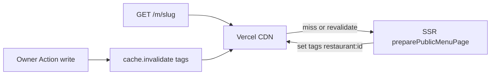

# Public cache on Vercel (DIG-26)

CDN caching for guest menu HTML. Owner mutations soft-invalidate by restaurant tag.

## Strategy



| Concern | Choice |
|---------|--------|
| Provider | Astro `cacheVercel()` (`astro.config.mjs`) — sets `Vercel-CDN-Cache-Control` / `Vercel-Cache-Tag` |
| Cached routes | `/m/[restaurant]`, `/m/[restaurant]/[menu]` only |
| Not cached | `/app/**`, `/`, auth, Actions |
| Freshness | `maxAge: 60`, `swr: 3600` (1 min fresh, then stale-while-revalidate up to 1 h) |
| Tags | `restaurant:{restaurantId}` (UUID) on every successful public menu response |
| Invalidation | Soft (stale + background revalidate) via `Astro.cache.invalidate({ tags })` |
| Dev | `Astro.cache.enabled === false` locally — tagging and invalidate are no-ops |

**Not used:** Cloudflare Cache API, in-process menu catalog cache (v1 `public-menu-cache.ts` is not ported), path purge alone (exact-match only; tags cover landing + all menu URLs).

## Tag on render

[`preparePublicMenuPage`](../src/lib/server/menu/prepare-public-menu-page.ts) after a successful load:

```ts
if (Astro.cache?.enabled) {
  Astro.cache.set({ tags: [`restaurant:${loaded.restaurantId}`] });
}
```

RouteRules supply `maxAge` / `swr`; tags merge with that policy.

## Invalidate on owner writes

[`revalidateRestaurantPublicMenu`](../src/lib/server/menu/revalidate.ts) + owner wrapper [`bustPublicMenuCache`](../src/lib/server/owner/action.ts).

Call `await bustPublicMenuCache(context, restaurantId)` after successful mutations. Purge errors are logged; they do not fail the Action.

| Action area | When |
|-------------|------|
| `restaurant` | basics, brand/theme, logos |
| `menus` | create / update / delete / move / setProducts |
| `categories` | create / update / delete / move |
| `tags` | create / update / delete |
| `products` | create / update / delete / deleteJson / batchUpdate / uploadImage / removeImage / setTags / setMenus / importCsv |

Not invalidated: `exportCsv`, `previewCsvImport` (read-only).

## Verification

- Local: caching stays off (`enabled === false`).
- Prod: CDN cache headers on `/m/…`; after an owner edit, next guest request eventually serves fresh HTML (may briefly serve stale per Vercel soft tags).
